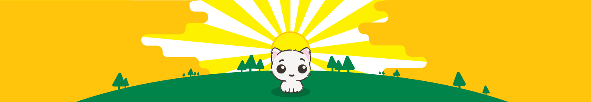
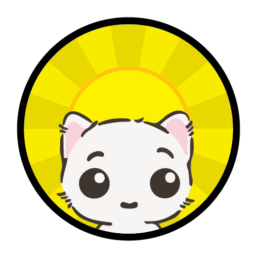
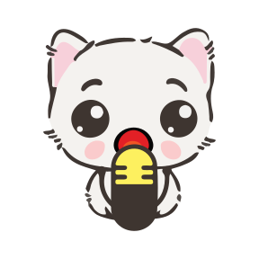
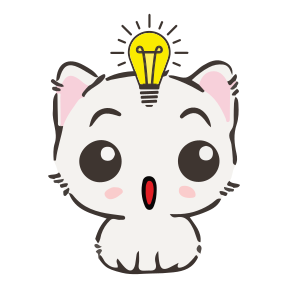
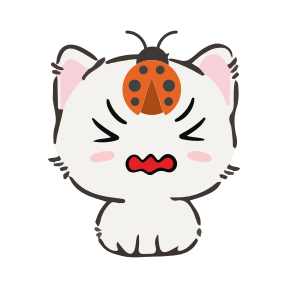
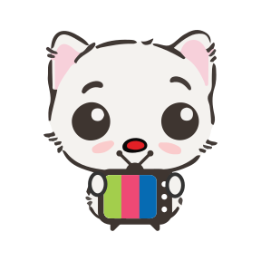
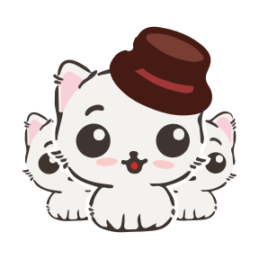
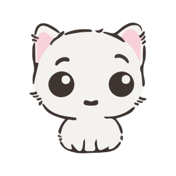

# Cute Cat Avatars

An illustrated cat collection for cat lovers.

---

### What is this?

Cute Cat Avatars are colorful cats illustrated by [Drew Rattana](http://andrewrattana.com) that can be used as profile picture placeholders for live websites or design mock ups.

### How to use

You can easily use these cats in `img` tags or HTTP requests. The response will be a cat in `Content-Type: image/svg+xml`.

**Base URL**: `https://cute-cat-avatars.laosing-cors.workers.dev`

#### HTML

```html

```

#### Javascript

```javascript
fetch("https://cute-cat-avatars.laosing-cors.workers.dev/api/v1/random")
  .then(res => res.blob())
  .then(blob => {
    const url = URL.createObjectURL(blob);
    document.getElementById("cat").src = url;
  });
```

### Pick your cat



There are multiple ways you can query for a cute cat.

**1. By specific Name:**
```
/api/v1/announcer
```

**2. By Seed (Index 0-13):**
The same seed will always return the same cat.
```
/api/v1/4
```

**3. By Random String:**
Any string that isn't a direct name match will be deterministically mapped to a cat based on its length.
```
/api/v1/!@#$%
```

**4. Truly Random:**
Returns a random cat every request.
```
/api/v1/random
```

### Collection

-  **announcer**
-  **support**
-  **idea**
-  **bug**
-  **award**
-  **news**
-  **tv**
-  **comic**
-  **book**
-  **art**
-  **gaming**
-  **general**
-  **groups**
-  **cat**

---

## Development

This project is built with **Bun**, **ElysiaJS**, and **Cloudflare Workers**.

### Prerequisites

- [Bun](https://bun.sh) (v1.1+)

### Local Development

To run the project locally (using Cloudflare Wrangler environment):

```bash
# Install dependencies
bun install

# Start local server (auto-regenerates cat list)
bun dev
```

Server will start at `http://localhost:8787`.

### Testing

Run unit and integration tests:

```bash
bun test
```

### Deployment

Deploy to Cloudflare Workers:

```bash
bun run deploy
```

## License

MIT
